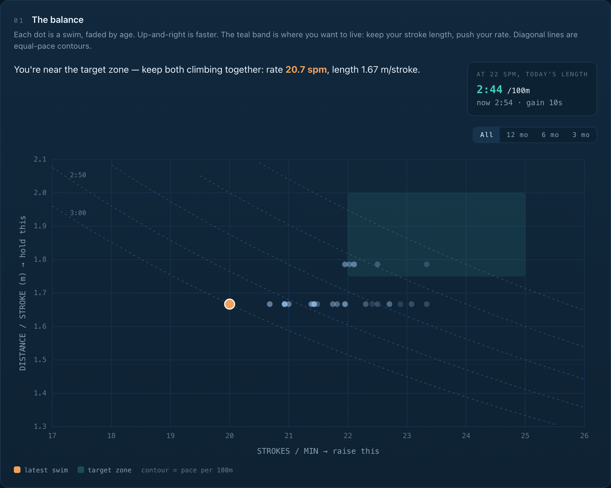
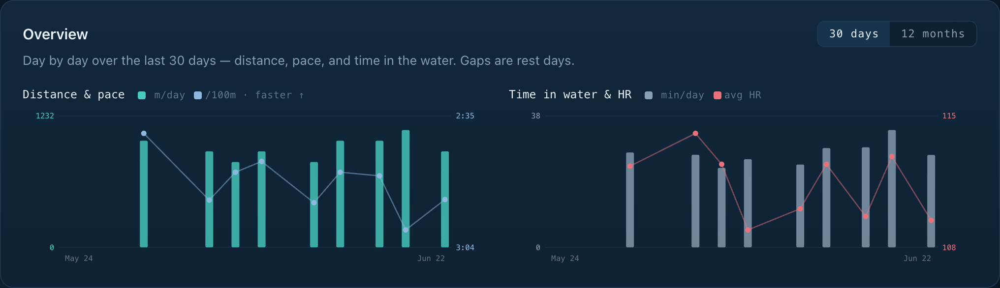
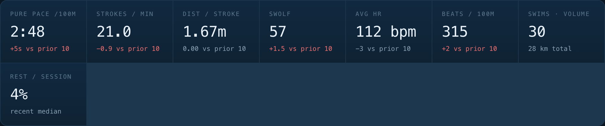
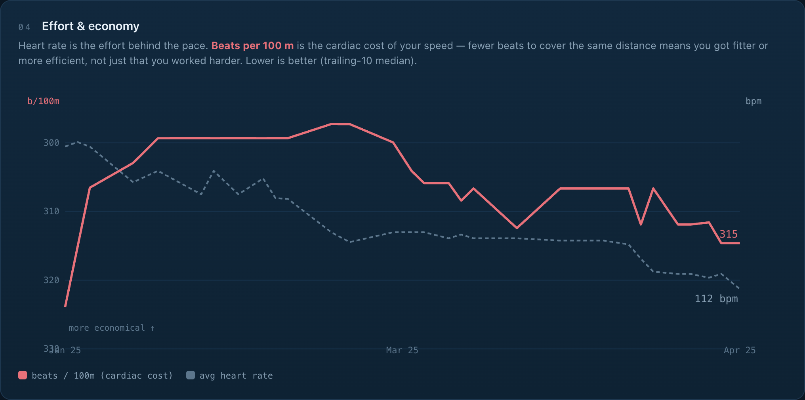
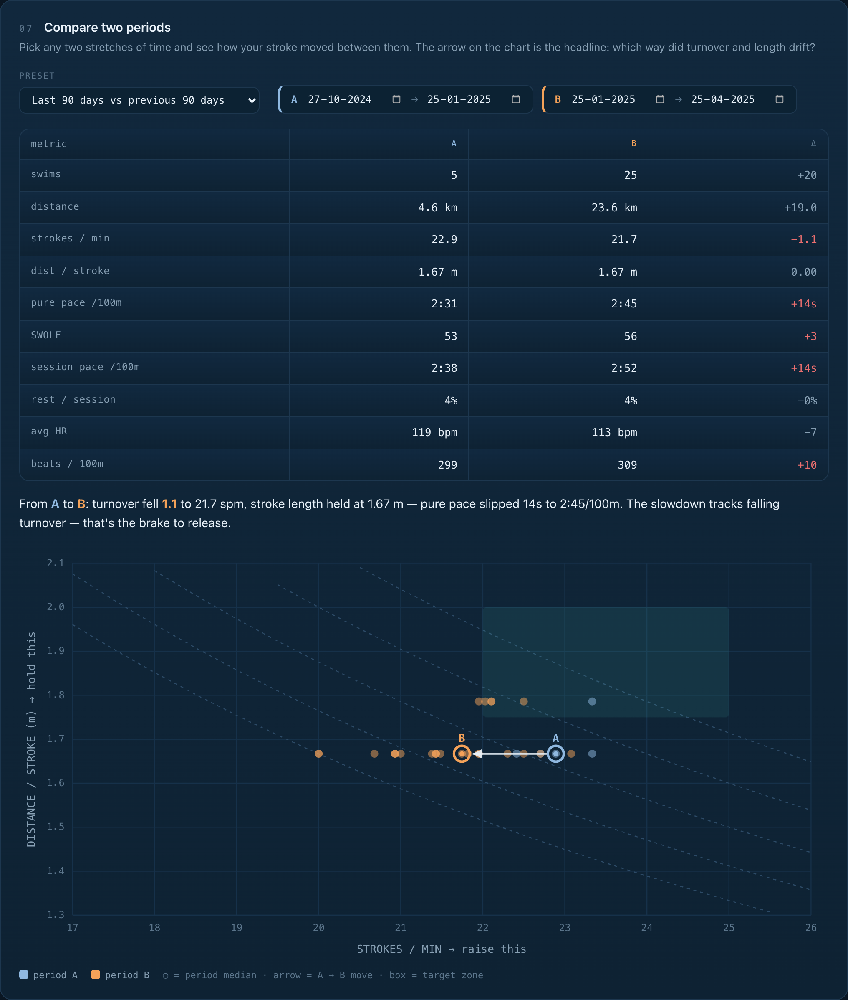

# swim-efficiency

A personal, **local-first toolkit for analyzing swim efficiency** from Apple Health data.
It turns an Apple Health export into lap-level metrics and a browser dashboard, plus an
8-week training plan — all running on your own machine. **Your health data never leaves
your computer.**

The toolkit exists to answer one coaching question:

> **Is my speed improving — and through which lever, stroke efficiency or effort?**



<sub>All screenshots use synthetic sample data (`tools/make_sample_data.py`) — no real health data.</sub>

The dashboard opens with an at-a-glance **Overview** — distance & pace, and time in water &
heart rate — that toggles between the **last 30 days** (day by day) and the **last 12 months**
(month by month):



## How it works

```
Apple Health "Export All Health Data" → export.zip → (unzip) → export.xml  (~500 MB)
        │
        │  extractors/extract_workouts.py   → workouts.csv   (per-swim summary)
        │  extractors/extract_swim_laps.py  → swim_laps.csv  (per-length detail)
        ▼
   tracker/swim_tracker.html  (drop the CSV in → interactive dashboard)
```

`export.xml` is huge (mostly heart-rate samples). Both extractors **stream** the file with
`xml.etree.ElementTree.iterparse`, so memory stays flat regardless of file size. They have
**zero pip dependencies** (Python 3 stdlib only).

The tracker is a **single self-contained HTML file** — no external/CDN dependencies, no
build step. It works fully offline from `file://`. All parsing and charting is hand-rolled
vanilla JS + SVG.

## The metrics

| Metric | Definition | Meaning |
|--------|-----------|---------|
| **SPM** | `strokes / (seconds/60)` | turnover / cadence |
| **DPS** (dist/stroke) | `pool_length / strokes` | stroke length / efficiency |
| **SWOLF** | `seconds + strokes` per length | combined efficiency (lower is better) |
| **Pure-swim pace** /100m | `Σ length seconds / distance × 100` | speed, rest excluded |
| **Session pace** /100m | `workout duration / distance × 100` | speed, rest included |
| **Speed** | `(SPM/60) × DPS` | the identity the whole tool is built around |
| **Cardiac cost** | `avg HR/60 × pure pace/100m` | beats per 100 m — effort economy (lower is better) |
| **CSS** (Critical Swim Speed) | `(400m TT − 200m TT) / 2` per 100m | sustainable race pace |

The tracker's hero chart (above) plots **SPM vs DPS** with a target zone and equal-pace contours,
so you can see at a glance whether you're getting faster by spinning your arms quicker (raising
turnover) or gliding farther per stroke (raising efficiency). The headline KPIs summarize the
recent trend:



It also folds in **heart rate as effort** — per-swim avg/max HR plus a *cardiac cost* metric
(**beats per 100 m**): fewer beats to cover the same distance means you got fitter or more
efficient, not just that you worked harder. This is what separates "faster because I improved"
from "faster because I pushed."



And it lets you **compare any two periods** — pick two date ranges (or a preset like "last 90 days
vs previous 90 days" or "last year vs previous year") and see a side-by-side metric strip, a
plain-English verdict, and a two-color scatter with an arrow showing exactly how your stroke
drifted between them.



> Color code (kept consistent everywhere): **amber = stroke rate**, **teal = distance/stroke**.

## Quick start

**The easy way — no terminal needed.** Open `tracker/swim_tracker.html` in any browser and
drag your Apple Health `export.xml` straight onto it. The swim data is parsed in-browser
(streamed, so even a ~500 MB export stays responsive and uses flat memory), and nothing is
uploaded. That's it.

**The CSV way** (still supported — useful for scripting or sharing just the swim data):

```bash
# 1. Extract metrics from your Apple Health export (Python 3, no dependencies)
python3 extractors/extract_swim_laps.py path/to/export.xml data/swim_laps.csv
python3 extractors/extract_workouts.py  path/to/export.xml data/workouts.csv

# 2. Open tracker/swim_tracker.html and drag data/swim_laps.csv onto it.
#    Optionally also drop data/workouts.csv to add rest analysis.
```

### Generate the training plan PDF (optional)

```bash
pip install -r requirements.txt   # needs weasyprint
python3 plan/generate_plan.py     # plan/plan.html → plan/swim_plan_8week.pdf
```

### Getting your Apple Health export

On your iPhone: **Health app → profile photo → Export All Health Data**. This produces
`export.zip`; unzip it to get `export.xml`.

## Repository layout

```
extractors/   Streaming Python extractors (Apple Health XML → CSV). Stdlib only.
tracker/      swim_tracker.html — the single-file dashboard.
plan/         8-week training plan (HTML → PDF generator).
docs/         FINDINGS.md — the analysis the tools are built around.
tools/        make_sample_data.py — synthetic data generator (no personal data).
tests/        Parser test harness + synthetic fixtures.
data/         Your extracted CSVs live here (gitignored — never committed).
```

## What the analysis found

From 227 swims (Nov 2024 → Jun 2026, all freestyle, 25 m pool, Apple Watch):

- **Stroke length improved then plateaued** — DPS rose 1.56 → 1.79 m (2024 → 2025), then flat.
- **Stroke rate steadily fell** — 22.9 → 21.1 → 19.6 SPM, drifting toward a slower, glide-heavy stroke.
- **In-water speed actually got slower in the last year** — pure-swim pace 2:44 → 2:39 → 2:52 /100m.
- **The slowdown was masked by less rest** — session pace looked flat (~3:40) only because rest
  dropped from ~34% to ~24% of each session.
- **Speed is driven by turnover, not stroke length** for this swimmer (length speed correlates
  −0.72 with SPM, +0.02 with DPS). Over-optimizing stroke length was a net brake.

**The takeaway, encoded in the tracker's target zone and the training plan:** raise SPM to
**22–24** while holding **DPS ≥ 1.79**, which projects to roughly **2:21–2:32 /100m**.

See [docs/FINDINGS.md](docs/FINDINGS.md) for the full write-up.

## Privacy

This is a local-first tool by design. Real health data (`export.xml` and your personal CSVs)
is **gitignored and never committed**. Anything in the repo that needs sample data uses the
synthetic generator at `tools/make_sample_data.py`.
